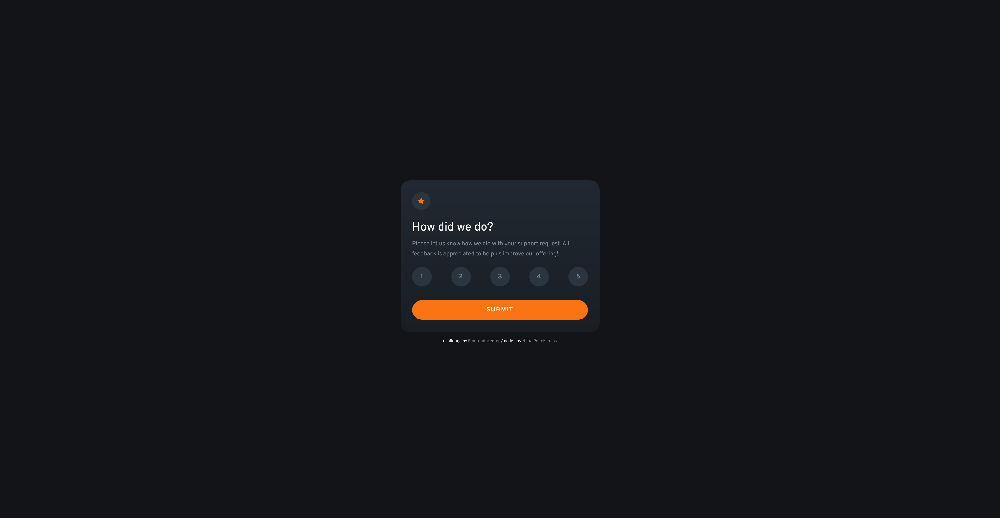

# Frontend Mentor - Interactive rating component solution

This is a solution to the [Interactive rating component challenge on Frontend Mentor](https://www.frontendmentor.io/challenges/interactive-rating-component-koxpeBUmI). Frontend Mentor challenges help you improve your coding skills by building realistic projects. 

## Table of contents

- [Overview](#overview)
  - [The challenge](#the-challenge)
  - [Screenshot](#screenshot)
  - [Links](#links)
- [My process](#my-process)
  - [Built with](#built-with)
  - [Userful resources](#useful-resources)
- [Author](#author)

## Overview

### The challenge

Users should be able to:

- View the optimal layout for the app depending on their device's screen size
- See hover states for all interactive elements on the page
- Select and submit a number rating
- See the "Thank you" card state after submitting a rating

### Screenshot

### Links

- Solution URL: [https://www.frontendmentor.io/solutions/interactive-rating-component-FKc0keivuC](https://www.frontendmentor.io/solutions/interactive-rating-component-FKc0keivuC)
- Live Site URL: [https://nooa-p.github.io/interactive-rating/](https://nooa-p.github.io/interactive-rating/)

## My process

### Built with

- HTML5
- CSS
- Flexbox
- JavaScript

### Useful resources

- Stack Overflow
- W3Schools
- MDN Web Docs

## Author

- GitHub - [nooa-p](https://github.com/nooa-p)
- Frontend Mentor - [@nooa-p](https://www.frontendmentor.io/profile/nooa-p)
